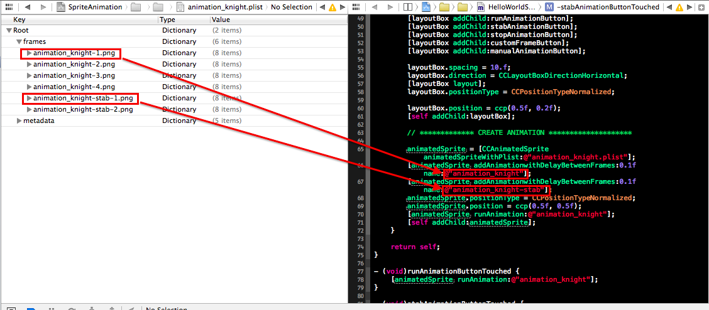

##### Note: This is the Kobold2D 2.x version. The cocos 2d 3.0 version lives on branch 'master'

# CCAnimatedSprite

This CCSprite subclass provides a simple way of animating Sprites in cocos2d 3.0.

## Usage

####Initialization:
Provide a .plist file generated either *Texture Packer* or *zwoptex*.

	CCAnimatedSprite *animatedSprite = [CCAnimatedSprite animatedSpriteWithPlist:@"animation_knight.plist"];

####Creating animations:
Select a duration for presenting each of the animation frames and provide an animation name. 
This animation name needs to correspond to the names in your plist. If the animation is called 
*animation_knight* your frames in the .plist need to be called *animation_knight-1.png*, *animation_knight-2.png* and so forth:

	[animatedSprite addAnimationwithDelayBetweenFrames:0.1f name:@"animation_knight"];
####Run animations:
Simply call *runAnimation* and provide a name of a previously created animation. This will run the animation in a loop.

	[animatedSprite runAnimation:@"animation_knight"];
	
####Stop animations:
Straightforward:
	
	[animatedSprite stopAnimation];

####Set a custom frame:
Manually sets a frame. Does not stop any running animation. The image name needs to be contained in the plist-File which was used to initialize this CCAnimatedSprite instance.
    
    [animatedSprite setFrame:@"animation_knight-1.png"];
    
####Access animation actions:
If you for any reason need to perform animations manually, for example if you want to run an animation only once instead of looping it, you can use *animationByName* to access the CCActionAnimate objects for each animation:
    
    // load the animation
    CCAnimate *animation = [animatedSprite animationByName:@"animation_knight"];

